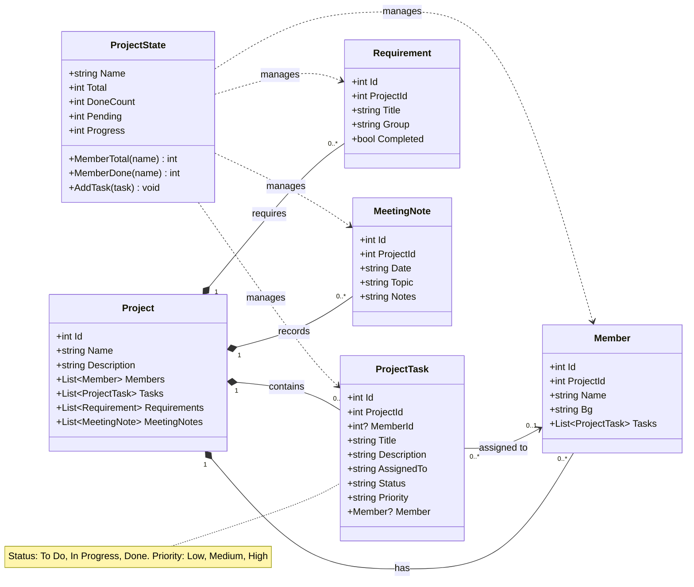

```mermaid
classDiagram
    direction LR

    class Project {
        +int Id
        +string Name
        +string Description
        +List~Member~ Members
        +List~ProjectTask~ Tasks
        +List~Requirement~ Requirements
        +List~MeetingNote~ MeetingNotes
    }

    class Member {
        +int Id
        +int ProjectId
        +string Name
        +string Bg
        +List~ProjectTask~ Tasks
    }

    class ProjectTask {
        +int Id
        +int ProjectId
        +int? MemberId
        +string Title
        +string Description
        +string AssignedTo
        +string Status
        +string Priority
        +Member? Member
    }

    class Requirement {
        +int Id
        +int ProjectId
        +string Title
        +string Group
        +bool Completed
    }

    class MeetingNote {
        +int Id
        +int ProjectId
        +string Date
        +string Topic
        +string Notes
    }

    class ProjectState {
        +string Name
        +int Total
        +int DoneCount
        +int Pending
        +int Progress
        +MemberTotal(name) int
        +MemberDone(name) int
        +AddTask(task) void
    }

    Project "1" *-- "0..*" Member : has
    Project "1" *-- "0..*" ProjectTask : contains
    Project "1" *-- "0..*" Requirement : requires
    Project "1" *-- "0..*" MeetingNote : records
    ProjectTask "0..*" --> "0..1" Member : assigned to

    ProjectState ..> Member : manages
    ProjectState ..> ProjectTask : manages
    ProjectState ..> Requirement : manages
    ProjectState ..> MeetingNote : manages

    note for ProjectTask "Status: To Do, In Progress, Done. Priority: Low, Medium, High"
```